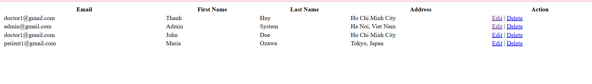
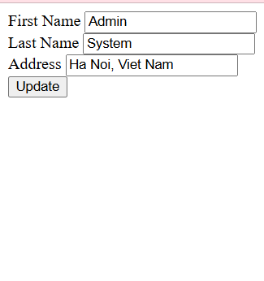

# FullStack01

## Mô tả dự án
Đây là một ứng dụng web full-stack được xây dựng bằng Node.js, Express.js, và Sequelize ORM. Ứng dụng cho phép quản lý người dùng (User) với các chức năng CRUD (Tạo, Đọc, Cập nhật, Xóa). Giao diện người dùng được xây dựng bằng EJS templates.

## Tính năng
- Quản lý người dùng: Thêm, sửa, xóa, xem danh sách người dùng
- Mã hóa mật khẩu bằng bcryptjs
- Kết nối cơ sở dữ liệu MySQL với Sequelize
- Giao diện web đơn giản với EJS

## Công nghệ sử dụng
- **Backend**: Node.js, Express.js
- **Database**: MySQL với Sequelize ORM
- **Frontend**: EJS (Embedded JavaScript Templates)
- **Authentication**: bcryptjs cho mã hóa mật khẩu
- **Development**: Babel, Nodemon

## Cài đặt

### Yêu cầu hệ thống
- Node.js (phiên bản 14 trở lên)
- MySQL Server
- npm hoặc yarn

### Các bước cài đặt
1. Clone repository:
   ```
   git clone <repository-url>
   cd fullstack01
   ```

2. Cài đặt dependencies:
   ```
   npm install
   ```

3. Thiết lập cơ sở dữ liệu:
   - Tạo database MySQL với tên `fullstack01`
   - Cập nhật thông tin kết nối trong `src/config/config.json` (development section)
   - Chạy migrations để tạo bảng:
     ```
     npx sequelize-cli db:migrate
     ```
   - (Tùy chọn) Chạy seeders để thêm dữ liệu mẫu:
     ```
     npx sequelize-cli db:seed:all
     ```

4. Tạo file `.env` trong thư mục gốc với nội dung:
   ```
   PORT=8080
   ```

## Sử dụng
Khởi động server:
```
npm start
```

Truy cập ứng dụng tại: `http://localhost:8080`

### Hình ảnh mô tả giao diện


### Hình ảnh form cập nhật


> Lưu ý: bạn có thể lưu file ảnh của màn hình vào `assets/screenshot.png` và ảnh form cập nhật vào `assets/update-form.png` để hiển thị đúng trong README.

### Các endpoint chính:
- `GET /`: Trang chủ (hiển thị tên tác giả)
- `GET /home`: Trang chủ với danh sách người dùng
- `GET /about`: Trang giới thiệu
- `GET /crud`: Form tạo người dùng mới
- `POST /post-crud`: Tạo người dùng mới
- `GET /get-crud`: Xem tất cả người dùng
- `GET /edit-crud?id=<id>`: Form chỉnh sửa người dùng
- `POST /put-crud`: Cập nhật người dùng
- `GET /delete-crud?id=<id>`: Xóa người dùng

## Cấu trúc dự án
```
src/
├── config/
│   ├── config.json          # Cấu hình Sequelize
│   ├── connectDB.js         # Kết nối database
│   └── viewEngine.js        # Cấu hình view engine EJS
├── controller/
│   └── homeController.js    # Controller xử lý logic
├── models/
│   ├── index.js             # Khởi tạo Sequelize models
│   └── user.js              # Model User
├── route/
│   └── web.js               # Định nghĩa routes
├── services/
│   └── CRUDService.js       # Service xử lý CRUD
├── views/
│   ├── crud.ejs             # Form tạo user
│   └── users/
│       ├── editUser.ejs     # Form chỉnh sửa user
│       └── findAllUser.ejs  # Danh sách user
├── migrations/              # Database migrations
└── seeders/                 # Database seeders
```

## Scripts
- `npm start`: Khởi động server với nodemon và babel-node
- `npm test`: Chạy test (chưa được cấu hình)
